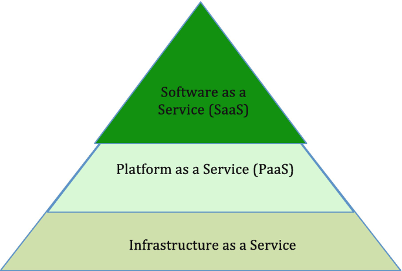
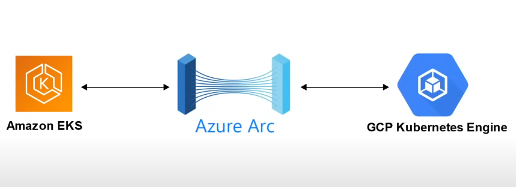
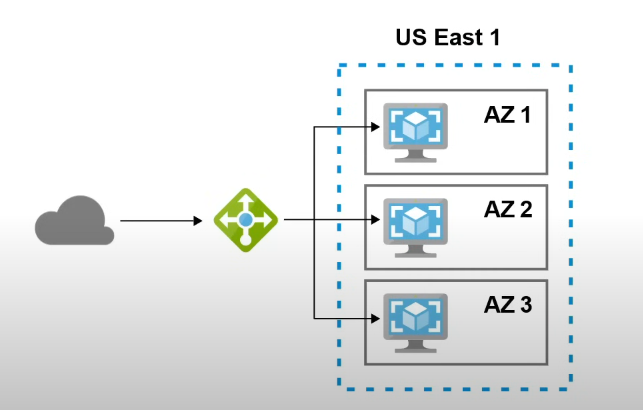
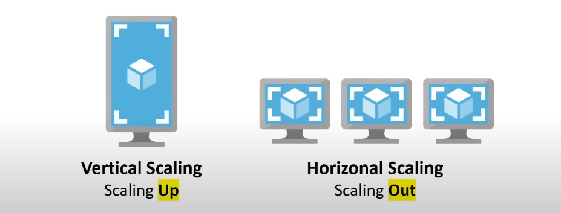
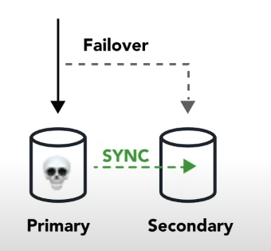
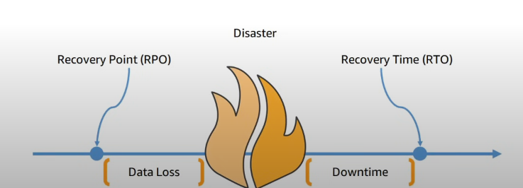

# Basic 

## What is Cloud computing
The practice of using a network of remote servers hosted on the internet to store, manage, and process data, rather than a local server or a personal computer.

| On-premise                      | Cloud Providers                                                                                        |
| ------------------------------- | ------------------------------------------------------------------------------------------------------ |
| you own the servers             | Someone else owns the servers                                                                          |
| you hire the IT people          | Someone else hires the IT people                                                                       |
| You pay or rent the real-estate | Someone else pays or rents the real-estate                                                             |
| You take all the risk           | You are responsible for your configuring cloud services and code, someone else takes care of the rest. |

## The Evolution of Cloud hosting
1. **Dedicated Server**
	- *One Physical machine* dedicated *to single a business.*
	- Runs a single web-app/site.
	- `Very expensive, high maintenance, High security`

2. **Virtual Private Server(VPS)**
	- *One physical machine* dedicated *to a single business.*
	- The physical machine is virtualized *into sub-machines.*
	- Runs multiple web-apps/sites.
	- `Better Utilization and isolation of resources`

3. **Shared Hosting**
	- *One physical machine*, shared by *hundred of businesses.* 
	- Relies on most tenants under-utilizing their resources.
	- `Very cheap, limited functionality, Poor isolation`

4. **Cloud Hosting**
	- *Multiple physical machines* that act as one system.
	- The system is abstracted into multiple *cloud services*
	- `Flexible, scalable, secure, Cost-effective, high configurability`

## Common Cloud Services
A cloud provider **can have hundreds of cloud services** that are grouped various types of services. The four most common types of cloud services for Infrastructure as a Service(IaaS) would be: 

1. **Compute**: Imagine having a virtual computer that can run application, programs and code.
2. **Storage**: Imagine having a virtual hard-drive that can store files.
3. **Networking**: Imagine having the virtual network being able to define internet connections or network isolations.
4. **Databases**: Imagine a virtual database for storing reporting data or a database for general purpose web-application.

## What is Microsoft and Azure
**Microsoft**
+ An american multinational computer technology corporation headquartered in Redmond, washington
+ Microsoft makes software, phones, tables, game consoles, cloud services, a search engine and more!
+ Microsoft has been around since the late 1970s and is well known for their Operating system windows.

**Azure**
+ Microsoft calls their cloud provider service Microsoft azure.
+ commonly referred to just Azure
+ Azure literally means bright blue color of the cloudless sky.
+ Cloud service providers can be initialized as CSPs

## Benefits of cloud computing
+ **Cost-effective** : you pay for what you consume, no up-font cost. Pay-as-you-go(PAYG) thousands of customers sharing the cost of the resources.
+ **Global** : Launch workloads anywhere in the world, just choose a region.
+ **Secure** : Cloud provider takes care of physical security. Cloud services can by secure by default.
+ **Reliable** : Data backup, disaster recovery, and data replication, and fault tolerance.
+ **Scalable** : Increase or decrease resources and services based on demand.
+ **Elastic** : Automate scaling during spikes and drop in demand.
+ **Current** : The underlying hardware and managed software is patched, upgraded and replaced by the cloud provider without interruption to you.

## Types of Cloud Computing
1. **SaaS(Software as a Service)**
	- A product that is run and managed by the service provider *Don't worry about how the service is maintained.*
	- *It just works and remains available.*
2. **PaaS(Platform as a Service)**
	- Focus on the deployment and management of your apps.
	- *Don't worry about, provisioning, configuring or understanding the hardware or OS.*
3. **IaaS(Infrastructure as a Service)** 
	- The basic building blocks for cloud IT. Provides access to networking features, computers and data storage space.
	- *Don't worry about IT staff, data center and hardware.*

## Types of Cloud Computing Responsibilities

| On-Premise               | Infrastructure as a Service | Platform as a Service | Software as a Service |
| ------------------------ | --------------------------- | --------------------- | --------------------- |
| Application(Customer)    | Application(Customer)       | Application(Customer) | Application(CSP)      |
| Data(Customer)           | Data(Customer)              | Data(Customer)        | Data(CSP)             |
| Runtime(Customer)        | Runtime(Customer)           | Runtime(CSP)          | Runtime(CSP)          |
| Middleware(Customer)     | Middleware(Customer)        | Middleware(CSP)       | Middleware(CSP)       |
| OS(Customer)             | OS(Customer)                | OS(CSP)               | OS(CSP)               |
| Virtualization(Customer) | Virtualization(CSP)         | Virtualization(CSP)   | Virtualization(CSP)   |
| Servers(Customer)        | Servers(CSP)                | Servers(CSP)          | Servers(CSP)          |
| Storage(Customer)        | Storage(CSP)                | Storage(CSP)          | Storage(CSP)          |
| Networking(Customer)     | Networking(CSP)             | Networking(CSP)       | Networking(CSP)       |

## Azure's Deployment Models
+ **Public cloud**
	- *Everything* built on the cloud provider Also known as: Cloud-Native
+ **Private Cloud** 
	+ Everything build on company's datacenters also known as on-premise.
	+ The cloud could be *OpenStack*
+ **Hybrid**
	+ Using both *On-Premise* and a *Cloud Service Provider*.
+ **Cross-Cloud** 
	+ using *Multiple cloud providers* Aka multi-cloud, hybrid-cloud
	 

## Total cost of ownership(TCO)
+ **On-Premise(CAPEX)**
	+ Implementation
	+ Configuration
	+ Training
	+ Physical Security
	+ Hardware
	+ IT Personal
	+ Maintenance 
	
+ **Azure(OPEX)**
	+ Implementation
	+ Configuration
	+ Training

## Capital vs Operational Expenditure
+ **Capitual Expenditure(CAPEX)**
	+ ==Spending money upfront== on *physical infrastructure* deducting that expense from your tax bill over time.
	+ server costs
	+ storage costs
	+ network costs
	+ backup and archive costs etc..

+ **Operational Expenditure(OPEX)**
	- The costs associated with an on-premises datacenter that has shifted the cost to the service provider. The customer only has to be concerned with non-physical costs.
	- Leasing software and customizing features
	- Training employees in cloud service.
	- Paying for cloud support
	- billing based on cloud matrics etc..

## Cloud Architecture Terminologies
+ **What is Solutions Architect** 
	+ A role in a technical organization that architects a technical solution using multiple systems via researching, documentation, experimentation.

+ **What is a cloud Architect** 
	+ A solutions architect that is focused solely on architecting technical solution using cloud services
	+ A cloud architect need to understand the following terms a factor them into their designed architecture based on the business requirements.
	+ *Availability*
	+ *Scalability*
	+ *Elasticity*
	+ *Fault Tolerance*
	+ *Disaster recovery*

## High Availability
Your ability for your service to **remain available** by ensuring there is ==no single point of failure== and/or ensure a certain level of performance.

Running you workload across multiple **Availability Zones** ensures that if 1 or 2 AZs become unavailable your service/applications remains available.

> [!IMPORTANT]
> **Azure load balancer**
> A load balancer allows you to evenly distribute traffic to multiple servers in one or datacenter. If a datacenter or server becomes unavailable (unhealty) the load balancer will route the traffic to only available datacenters with servers.

## High Scalability 
Your ability to **increase you capacity** based on the increasing demand of traffic, memory and computing power.

**Vertical Scaling** - Upgrade to a bigger server.
**Horizontal Scaling** - Add more servers to the same size.

## High Elasticity 
Your ability to **automatically** increase or decrease your capacity based on the current demand of traffic, memory and computing power.

**Horizontal scaling**
+ Scaling out - Add more servers to the same size.
+ Scaling in - Removing more servers to the same size.

> [!NOTE]
> *Vertical scaling is generally hard for traditional architecture so you'll usually only see horizontal scaling described with Elasticiyt.*

> [!IMPORTANT]
> **Azure VM Scale Sets**
> 	- Automatically increase or decrease in response to demand or a defined schedule.
>
>  **SQL Server Stretch Database**
> 	- Dynamically streatch warm and cold transactional data from microsoft SQL server 2016 to Microsoft Azure

## Highly Fault Tolerant
Your ability for you service to ensure there is no ==no single point of failure==. Preventing the chance of failure.

**Fail-Overs** is when you have a plan to shift traffic to redundant system in case the primary system fails.

> [!IMPORTANT]
> You can use **Azure Traffic Manager** which is a DNS-based traffic balancer to fail-over from a failing primary system to a stand-by secondary system.

## High Durability
Your ability to **recover** from a disaster and to prevent **the loss** of data solutions that recover from a disaster is known as ==Disaster recovery(DR)==.

+ Do you have a backup?
+ How fast can you restore that backup?
+ Does your backup still work?
+ How do you ensure current live data is not corrupt?

## Business Continuity Plan(BCP)
A **business continuity plan(BCP)** is a document that outlines how a business will continue operating **during an unplanned disruption is services**.

+ **Recovery point objective(RPO):** the maximum accepted amount of data loss after an unplanned data-loss incident, expressed as an amount of time.
+ **Recovery time objective(RTO):** the maximum amount of downtime your business can tolerate without incurring a significant financial loss.

## Disaster recovery options

## The Evolution of Computing
### Dedicated Servers
+ A physical server **wholly utilized by a single customer**.
- you have to guess your capacity, you'll overpay for an underutilized server.
- Upgrading beyond your capacity will be slow and expensive. 
- You are limited by your operating system.
- You have a **guarantee to security, privacy and full utility of underlying resources**.

