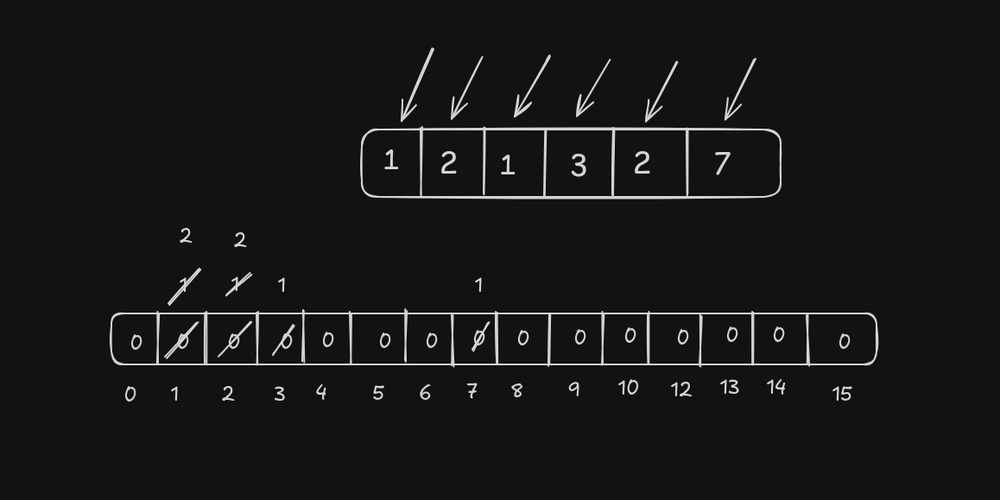

# Hashing

Hashing is a technique used in data structures that efficiently stores and retrieves data in a way that allows for quick access. It involves mapping data to a specific index in a hash table using a hash function that enables fast retrieval of information based on its key

- **Example**
  - for this example consider the array of size 5 with element \[ 1, 2, 1, 3, 2, 7 \]
  - created array of size 2^n for the integer type.
  - first select the 1st element in add into new array for at the index of the array element. similarly for other element.
  - while accessing access the count at that specific index.

## Time Complexity

- storing and fetching in map take `O(log(N))` in all cases (best, avg, worst).

- **for Unordered map**
  - the time complexity storing and fetching take `O(1)` for (best, average) case.
  - it will take `O(N)` for worst case.

## Hashing technique used for map data

- Division method
- Folding method
- Mid-Square method
  Hashing is a technique used to map data to a fixed-size value, often used in hash tables to facilitate fast data lookups. There are various methods for implementing hash functions, with the **division method** being one of the most common. Here's how it and other methods work:

### 1. **Division Method** (important)

In the division method, the key is divided by a prime number, and the remainder is used as the hash value. The prime number is often chosen to avoid clustering of hash values. This method is simple and effective for many applications.

**Formula**:  
\[ h(k) = k \mod m \]

- `k` is the key.
- `m` is the size of the hash table (often a prime number).

**Example**:  
For a key `k = 1234` and a table size `m = 10` (though it's better to use a prime),  
\[ h(1234) = 1234 \mod 10 = 4 \]  
So the key `1234` would be placed in slot 4 of the table.

### 2. **Folding Method**

The folding method splits the key into equal parts (except possibly the last part, which may be shorter), then sums the parts together to get the hash value. It can involve different folding techniques like reverse folding (reversing some parts before summing).

**Example**:  
For a key `k = 1234567890`, split it into parts of 3 digits:  
`123`, `456`, `789`, `0`.  
Now sum them:  
\[ 123 + 456 + 789 + 0 = 1368 \]  
If the table size `m = 1000`,  
\[ h(1368) = 1368 \mod 1000 = 368 \]  
So the key `1234567890` would be placed in slot 368.

### 3. **Mid-Square Method**

In the mid-square method, the key is squared, and a portion of the middle digits of the result is taken as the hash value.

**Example**:  
For a key `k = 5678`,  
\[ 5678^2 = 32239684 \]  
Extract the middle digits (for instance, 4 digits starting from the middle): `2396`.  
If the table size `m = 1000`,  
\[ h(2396) = 2396 \mod 1000 = 396 \]  
So the key `5678` would be placed in slot 396.
