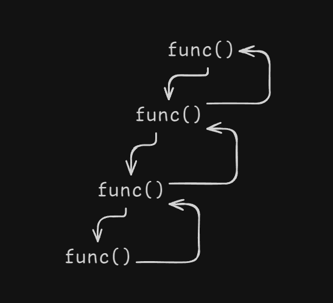
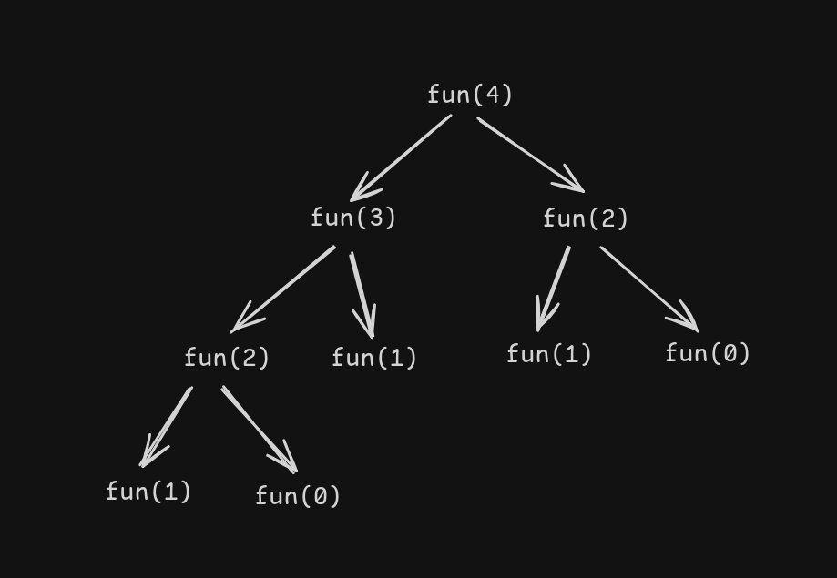

# Recursion

## Introduction to Recursion

When a **function calls itself untill a specifical condition is met**.

### Explanation

```syntax
void func() {
print(1);
func();
}

main() {
func();
}
```

- At first program comes to `main()`, when ever i call the function `func()` it will go the the _void func()_ function.
- the function will execute the `print(1)` in func(), then function will call it self when will print again 1 in output. and this process repeat.
- because it don't have stop condition.

- Python example

```python
def func():
    print("1")
    func()

if __name__ == "__main__":
    func()
```

- java example

```java
class Main {
    public static void func(){
        System.out.println("1");
        func();
    }

    public static void main(String args[]) {
        func();
    }
}
```

- this code will give stack overflow error, because when function is called the function will be waiting in memory(stack memory) at one point the stack will be full and it will give error.

### Base Case

```python
count = 0

def func():
    global count
    if count == 4:
        return
    print("1")
    count += 1
    func()

if __name__ == "__main__":
    func()
```

- code will not give stack overflow error, it will terminate the function when count == 4.

```java
class Main {
    static int count = 0;
    public static void func(){
        if ( count == 4 ) return;
        System.out.println(count);
        count++;
        func();
    }

    public static void main(String args[]) {
        func();
    }
}
```

## Recursion Tree

A recursion tree is **a graphical representation that illustrates the execution flow of a recursive function**.



## Basic Recursion Problems

- Print name 5 times
- Print linearly from 1 to N
- Print from N to 1
- Print Linearly from 1 to N ( but by backtrack )
- Print from N to 1 ( by Backtrack )

problem link

- [java](./../JAVA-DSA/Recursion.java)
- [python](./../Python-DSA/Recursion.py)

## Parameterised and functional recursion

- Sum of first N number, in two different ways
  - Parameter
  - functional
- Reverse an array

## Multiple Recursion Calls

- Fibonacci number using multile recursion calls
- Example: This example for fibonacci number for 4


