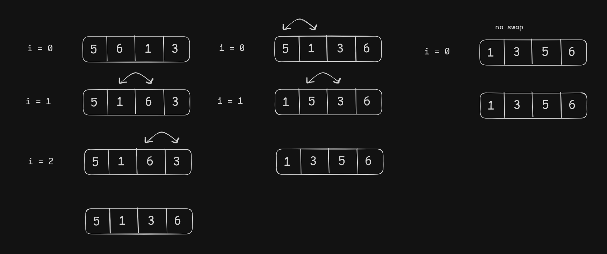
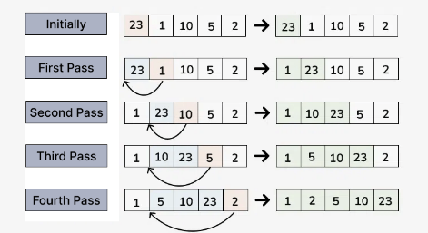
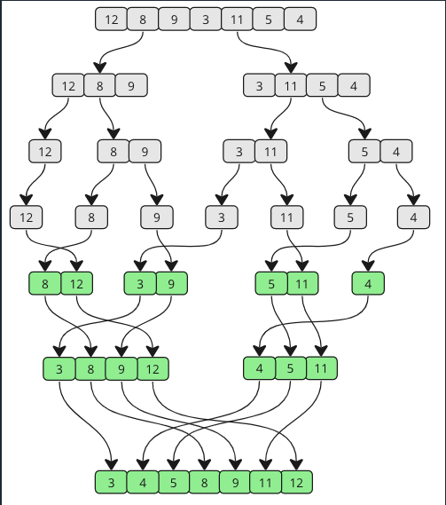
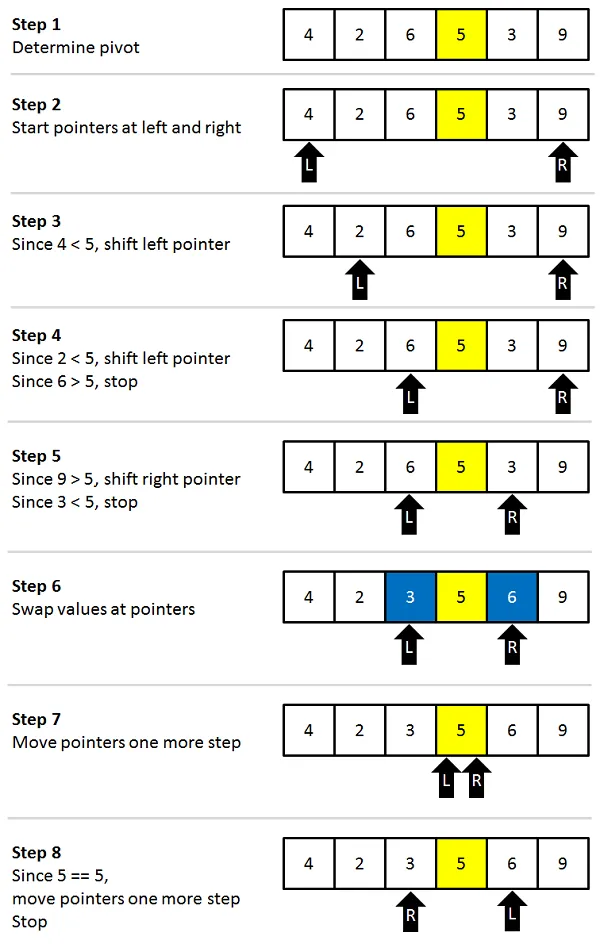

# Sorting Algorithm

## 1. Selection Sort

**Step of the selection sort algorithm**

1.  Start with the first element as the initial position.
2.  Find the smallest element in the unsorted portion of the array.
3.  Swap this smallest element with the first unsorted element.
4.  Move the boundary of the sorted portion one element forward.
5.  Repeat steps 2-4 for the remaining unsorted elements until the entire array is sorted.

**Code**

- [java](./../JAVA-DSA/SelectionSort.java)
- [python](./../Python-DSA/SelectionSort.py)

**Time Complexity**

- best , worst, and average time complexity is `O(N^2)`

## 2. Bubble Sort

**Step of the Bubble sort algorithm**

1. Start at the first element of the array.
2. Compare the current element with the next element.
3. If the current element is greater than the next element, swap them.
4. Move to the next pair of elements and repeat the comparison and swap if needed.
5. After each complete pass through the array, the largest unsorted element is placed at its correct position at the end of the array.
6. Repeat the above process of a pass for the remaining unsorted elements until the entire array is sorted.

**Code**

- [java](./../JAVA-DSA/BubbleSort.java)
- [python](./../Python-DSA/BubbleSort.py)

**Time Complexity**

- Worst or Average time complexity is `O(N^2)`
- Best time complexity is `O(N)`

## 3. Insertion Sort

**Step of the Insertion sort algorithm**

1. We start with second element of the array as first element in the array is assumed to be sorted.
2. Compare second element with the first element and check if the second element is smaller then swap them.
3. Move to the third element and compare it with the second element, then the first element and swap as necessary to put it in the correct position among the first three elements.
4. Continue this process, comparing each element with the ones before it and swapping as needed to place it in the correct position among the sorted elements.
5. Repeat until the entire array is sorted.

**Code**

- [java](./../JAVA-DSA/InsertionSort.java)
- [python](./../Python-DSA/InsertionSort.py)

**Time Complexity**

- Worst or Average time complexity is `O(N^2)`
- Best time complexity is `O(N)`

## 4. Merge Sort

**Divide**: The algorithm starts with breaking up the array into smaller and smaller pieces until one such sub-array only consists of one element.

**Conquer**: The algorithm merges the small pieces of the array back together by putting the lowest values first, resulting in a sorted array.

**Code**

- [java](./../JAVA-DSA/MergeSort.java)
- [python](./../Python-DSA/MergeSort.py)

**Time Complexity**

- In all the case best, worst, average merge sort has `O(N logN)` time complexity.

## 5. Quick Sort

**How it works:**

1. Choose a value in the array to be pivot element.
2. Order the rest of the array so that lower values than the pivot element are on the left, and higher values are on the right.
3. Swap the pivot element with the first element of the higher values so that the pivot element lands in between the lower and higher values.
4. Do the same operations ( recursively ) for the sub-arrays on the left and right side of the pivot element.

**Code**

- [java]()
- [python]()

**Time Complexity**

