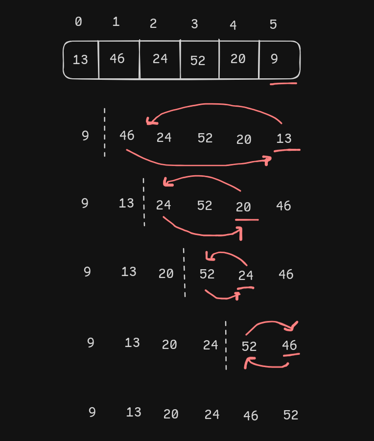

# Sorting Algorithm

## Selection Sort

**Step of the selection sort algorithm**

1.  Start with the first element as the initial position.
2.  Find the smallest element in the unsorted portion of the array.
3.  Swap this smallest element with the first unsorted element.
4.  Move the boundary of the sorted portion one element forward.
5.  Repeat steps 2-4 for the remaining unsorted elements until the entire array is sorted.

**Code**

- [java](./../JAVA-DSA/SelectionSort.java)
- [python](./../Python-DSA/SelectionSort.py)

**Time Complexity**

- best , worst, and average time complexity is `O(n^2)`

## Bubble Sort
