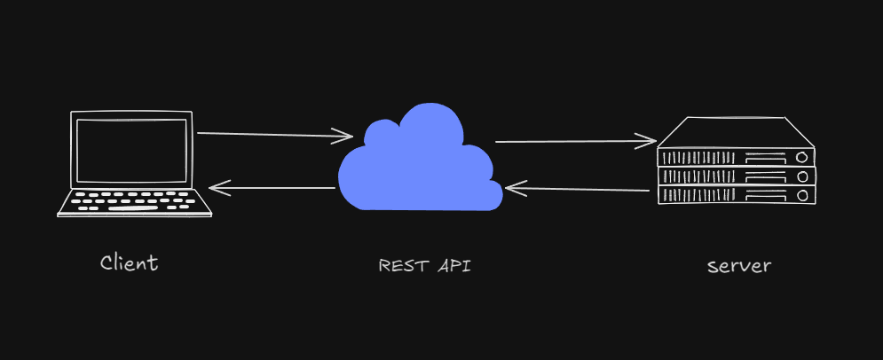
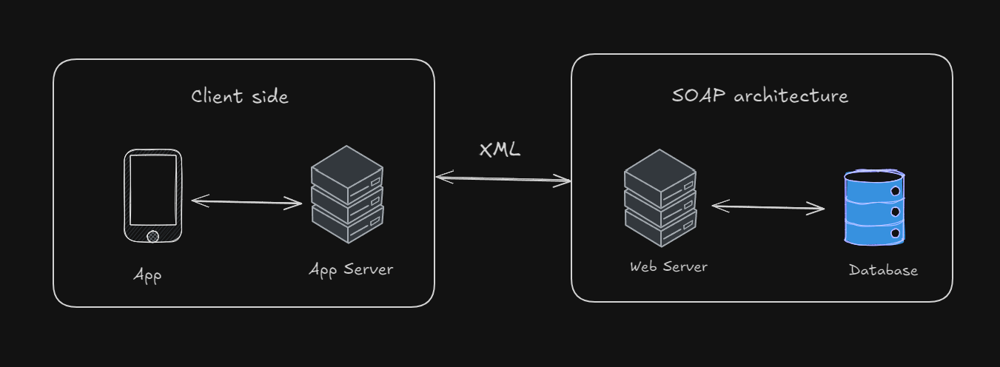
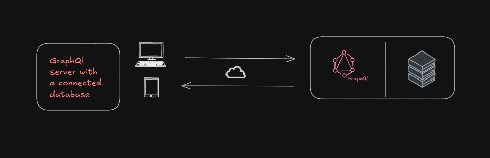
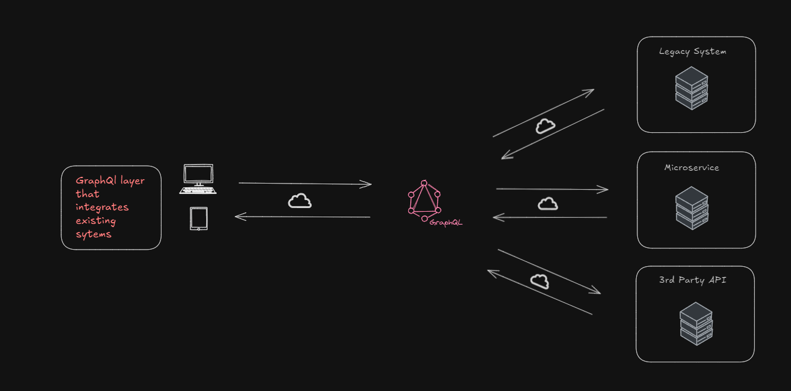
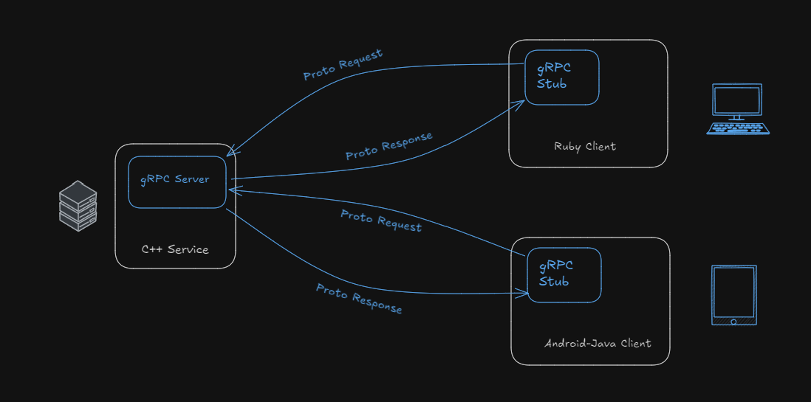
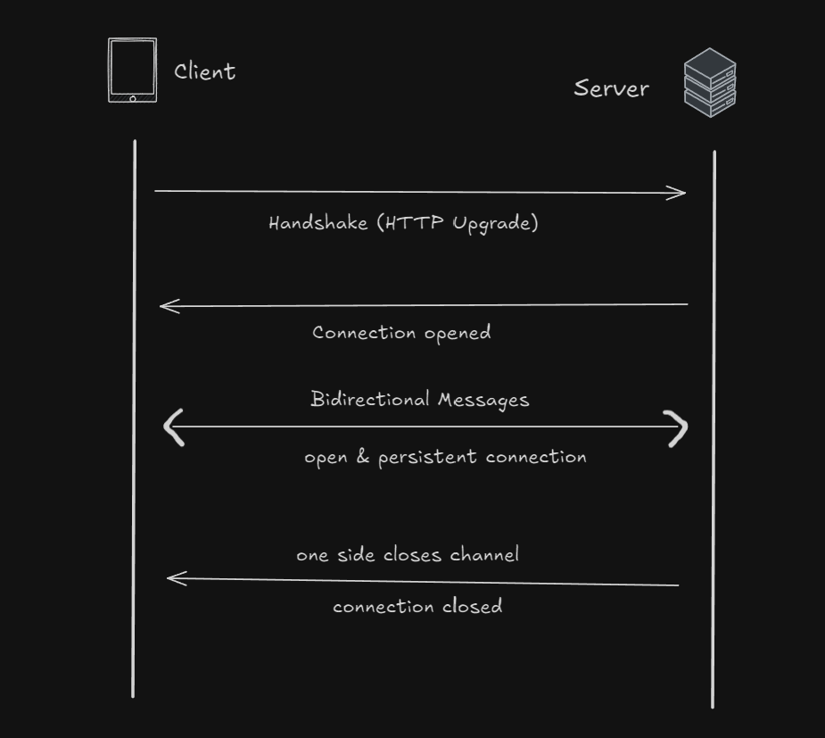
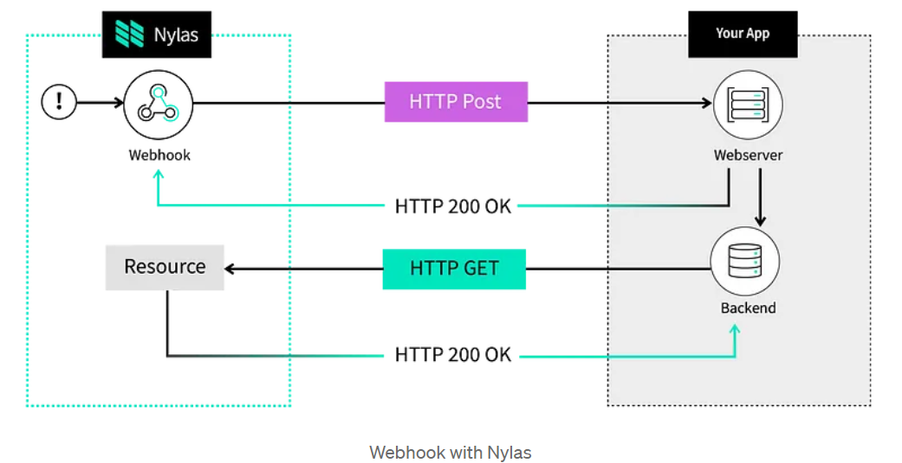

# API Architecture 

**What are API used for?**
- They serve as the backbone of our interconnected digital world.
- APIs, or `Application Programming Interfaces`, play a pivotal role in facilitating communication and interaction between distinct software components.
- Acting as bridges, they enable data exchange, function calls, and seamless integration across different software systems.
- To support these operations, several architectural styles have been developed, each with its own design philosoply and use cases. 

## REST

RESTful APIs (Representational State Transfer) are a widely used architecture for designing networked applications. They leverage web standards, like HTTP, to define a set of operations that clients can use to interact with server data in a consistent, stateless way.

### Key Characteristics of RESTful APIs:
+ **HTTP Methods**: REST uses HTTP methods to define operations:
   - GET to retrieve data
   - POST to create new data
   - PUT to update data
   - DELETE to remove data
+ **Data Formats**: RESTful APIs commonly use JSON or XML for data exchange, allowing compatibility with a wide range of systems.
+ **Statelessness**: Each request from the client to the server must contain all the information needed to understand and complete the request, meaning no client context is stored on the server between requests.
+ **Caching**: RESTful APIs support caching, improving speed and reducing server load by allowing certain data to be stored and reused.

### Pros of RESTful APIs:
+ **Simplicity and Familiarity**: Easy to understand and implement as it uses standard HTTP methods and URIs.
+ **Interoperability**: Follows web standards, making it compatible with web browsers and widely supported across devices and programming languages.
+ **Scalability**: Statelessness and caching make REST ideal for handling many requests and high server loads.
+ **Flexibility**: Supports various data formats and media types, allowing developers to choose based on requirements.

### Cons of RESTful APIs:
+ **Lack of Schema**: REST doesn’t enforce a strict contract for data formats, which can lead to inconsistencies and unclear expectations for how data should be structured.
+ **Limited for Complex Operations**: REST can struggle with complex queries or interdependent data, often requiring multiple requests to gather all relevant information.
+ **Error Handling**: Relies on HTTP status codes for error responses, which may not always convey enough detail, leading to potential confusion.

### Usage
REST is good for situations where:
- The data model is simple and stable.
- The clients and servers are not dependent on each other.
- The speed and scalability are important.

## SOAP

**SOAP** (Simple Object Access Protocol) is a protocol that uses XML to structure and exchange information between applications, often over HTTP. It relies on a predefined, strict contract, enabling consistent communication between clients and servers. SOAP is known for its maturity and is particularly valuable in scenarios requiring high security and reliability, such as financial services.

### Key Characteristics of SOAP:
- **XML-Based**: SOAP exclusively uses XML for data formatting, making it verbose but highly structured and standardized.
- **Strict Contract**: SOAP APIs are defined by a contract (WSDL - Web Services Description Language) that ensures precise expectations and compatibility between client and server.
- **Built-In Error Handling**: SOAP uses “SOAP faults” to provide detailed error messages, making it easier to debug complex transactions.
- **Extended Capabilities**: Supports complex transactions, security standards (such as WS-Security), and reliable messaging, making it suitable for high-stakes environments.

### Pros of SOAP:
1. **Interoperability**: SOAP's strict contract ensures that different systems can reliably communicate, even if they’re built in different programming languages or are on different platforms.
2. **Complex Operations**: Ideal for complex and secure transactions, including multi-step processes, authentication, and authorization.
3. **Detailed Error Reporting**: SOAP faults provide standardized, detailed error information, making it easier to handle exceptions gracefully.

### Cons of SOAP:
1. **Complexity and Verbosity**: XML messages in SOAP are extensive, making the protocol heavy and complex to understand and implement.
2. **Not Aligned with Web Standards**: SOAP doesn’t follow typical RESTful web principles, adding extra overhead to standard web protocols.
3. **Limited Scalability**: SOAP doesn’t support statelessness or caching, making it less efficient and slower for handling large volumes of traffic.
4. **Low Flexibility**: Changing a SOAP API requires updates to the contract, making it harder to evolve without disrupting clients.

### When to Use SOAP:
SOAP is a good fit when:
- **Complex, Secure Transactions**: It is essential in industries with stringent security and transactional requirements, like banking and finance.
- **High Reliability Required**: Situations where reliable, well-defined error handling is needed.
- **Tightly Coupled Systems**: SOAP works well for systems that are interdependent and tightly coupled.

## GraphQL

**GraphQL** is both an architectural style and a powerful query language that allows clients to request exactly the data they need, minimizing over-fetching and under-fetching. Created by Facebook to serve precise data efficiently to millions of users, GraphQL is now widely used by platforms like GitHub and Shopify. Its flexibility and efficiency make it ideal for applications with complex data structures.

### Key Characteristics of GraphQL:
- **Query Language**: GraphQL allows clients to specify exactly what data they need, returning only what is requested. This is different from REST, where fixed endpoints may lead to under-fetching or over-fetching data.
- **Single Endpoint**: GraphQL operates through a single endpoint, enabling clients to query all necessary data without making multiple requests.
- **Schema Definition**: GraphQL uses a strongly-typed schema, ensuring that data is structured and validated, fostering better compatibility and clarity.
- **Real-Time Capabilities**: Supports real-time data with features like **mutations** (to update data) and **subscriptions** (for live updates when data changes).

### Pros of GraphQL:
1. **Efficient Data Fetching**: Clients can request specific data fields, avoiding over-fetching or under-fetching, which results in faster and more efficient data retrieval.
2. **Single Endpoint**: Unlike REST, GraphQL operates with a single endpoint, reducing the need for multiple calls to gather related data.
3. **Strong Typing**: GraphQL’s schema is strongly typed, ensuring consistent and well-defined data exchange between clients and servers.
4. **Server-Agnostic**: Works with any server language or framework, as it defines data structures independently through its schema.

### Cons of GraphQL:
1. **Steep Learning Curve**: Requires learning a new syntax and logic, making it initially more challenging for developers familiar with REST.
2. **Caching Limitations**: GraphQL doesn’t support caching out-of-the-box, which can impact performance if not handled carefully.
3. **Error Handling**: GraphQL typically returns an HTTP 200 status code even for errors, as errors are handled within the response body rather than HTTP status codes.

### When to Use GraphQL:
GraphQL is suitable when:
- **Data Requirements are Complex**: Ideal for applications with nested and interrelated data, where specific data fetching is essential.
- **Flexible Client-Server Communication**: Allows clients to define their data needs independently from the server’s structure.
- **Performance is a Priority**: Reduces bandwidth usage by returning only the requested data, which is helpful in mobile apps or environments with limited bandwidth.

## gRPC 

**gRPC** (gRPC Remote Procedure Calls) is a high-performance API architecture that uses Protocol Buffers (Protobuf) for data serialization, enabling fast, efficient communication between services. With its support for HTTP/2 and binary data format, gRPC is a favorite choice for microservices architectures, especially in companies like Netflix that require extensive, reliable inter-service communication. However, its reliance on custom headers and non-standard methods limits gRPC's compatibility with browser clients.

### Key Characteristics of gRPC:
- **Protocol Buffers (Protobuf)**: gRPC uses Protobuf, a compact binary data format, which is faster and smaller than formats like JSON or XML.
- **HTTP/2 Support**: Leverages HTTP/2 features, including multiplexing, header compression, and low latency, for efficient data transfer.
- **Strict Contract**: Like SOAP, gRPC relies on a strict service definition, ensuring compatibility and interoperability between services.
- **Streaming and Bidirectional Communication**: Supports four types of RPCs, including simple, server-streaming, client-streaming, and bidirectional streaming, allowing complex data flows and real-time interactions.

### Pros of gRPC:
1. **High Performance**: With HTTP/2 and binary Protobuf format, gRPC achieves low latency and high efficiency, making it ideal for high-throughput, low-latency communication.
2. **Clear Service Contract**: Protobuf files define a strict contract, ensuring structured, compatible communication between services.
3. **Supports Advanced Features**: Offers built-in support for streaming, bidirectional communication, and robust security options like encryption and authentication.

### Cons of gRPC:
1. **Complex Setup**: Requires learning Protobuf and generating files, which adds complexity to setup and development.
2. **Limited Browser Compatibility**: gRPC’s use of custom HTTP/2 headers makes it difficult to work directly with browsers, as they lack native support.
3. **Doesn’t Follow RESTful Principles**: gRPC is not designed with web principles in mind, so it lacks some of the conveniences that come with REST, such as standardization with HTTP methods and headers.

### When to Use gRPC:
gRPC is best suited for:
- **Microservices Architectures**: Ideal when there’s a need for high-speed, low-latency communication between tightly-coupled services.
- **Complex Data and Real-Time Needs**: Useful for applications requiring complex data structures, real-time interactions, or streaming data.
- **Performance-Critical Applications**: Works well when bandwidth efficiency and minimal latency are priorities, as in real-time systems or large-scale distributed applications.

## WebSocket

**WebSocket** is a protocol designed for real-time, bidirectional communication over a single, persistent connection. Unlike traditional HTTP, which operates in a request-response model, WebSocket allows servers to push data to clients instantly, making it ideal for applications where low-latency communication is crucial, such as live chat, gaming, and real-time streaming.

### Key Characteristics of WebSocket:
- **Persistent Connection**: WebSocket maintains an open connection between the client and server, allowing continuous data exchange without the need for repeated requests.
- **Bidirectional Communication**: Both the client and server can send messages independently of each other, supporting true bidirectional data flow.
- **Efficient Data Transfer**: WebSocket reduces overhead by avoiding repeated HTTP headers, resulting in faster data transfer.

### Pros of WebSocket:
1. **Low Latency and Efficiency**: WebSocket is faster than HTTP for continuous data streams because it avoids repetitive request headers, making it efficient for high-frequency message exchange.
2. **Supports Multiple Message Types**: Can handle text, binary data, and even streaming data, making it versatile for various real-time applications.
3. **Server Push Capabilities**: Allows the server to send data to the client without waiting for a request, supporting real-time, event-driven communication.

### Cons of WebSocket:
1. **Limited Browser and Proxy Support**: Older browsers or network proxies may not support WebSocket or its upgrade header, impacting compatibility.
2. **Security Considerations**: WebSocket connections aren’t secure by default. Using the `wss://` scheme (WebSocket Secure) adds encryption similar to HTTPS, but it requires explicit implementation.
3. **Statelessness**: WebSocket doesn’t inherently maintain state, so session management and message tracking need to be handled separately.

### When to Use WebSocket:
WebSocket is ideal for scenarios where:
- **Real-Time Interaction is Essential**: Suitable for applications needing instant feedback and continuous communication, such as live chat, collaborative tools, or multiplayer games.
- **Bidirectional Data Flow is Required**: When both client and server need to exchange messages independently and continuously.
- **Event-Driven Communication**: Useful in applications where the server needs to send updates or alerts to clients as soon as events occur.

## Webhooks

**Webhooks** are an event-driven architecture that uses HTTP callbacks to enable asynchronous, one-way communication between servers and clients. When a specific event occurs on the server, a Webhook sends a POST request to a pre-configured client URL, delivering a payload containing event information. This is widely used for scenarios like GitHub notifying another system about new commits, enabling systems to react to events without needing constant polling.

### Key Characteristics of Webhooks:
- **Event-Driven**: Webhooks are triggered by specific events, sending data to clients only when relevant actions occur.
- **Asynchronous Communication**: Webhooks operate asynchronously, freeing both the server and client from waiting for responses.
- **One-Way Notifications**: Webhooks only deliver notifications to clients without expecting a response, making them lightweight but limited to simple communication.

### Pros of Webhooks:
1. **Simplicity**: Webhooks are straightforward to set up and use, leveraging standard HTTP methods like POST, making them easy to understand and implement.
2. **Follows Web Principles**: Uses established web standards and protocols, making it compatible with a wide range of systems.
3. **Scalable and Efficient**: Since they only trigger on specific events, Webhooks reduce unnecessary network traffic and latency compared to regular polling.

### Cons of Webhooks:
1. **Lacks Strict Contract**: Without a standardized schema, Webhooks can lead to inconsistencies in data and structure, requiring careful coordination between systems.
2. **Limited Functionality**: Webhooks support one-way notifications only, with no feedback, acknowledgment, or complex querying capabilities.
3. **Error Handling Challenges**: Webhooks do not natively support retry mechanisms or confirmations, which can be problematic if a notification fails to reach its destination.

### When to Use Webhooks:
Webhooks are well-suited for:
- **Event-Driven Notifications**: Ideal for triggering actions in response to specific events, like notifying systems of a completed payment or new commit.
- **Simple, Stable Data Models**: Works best when only basic data needs to be exchanged without complex structures.
- **Decoupled Systems**: Useful when servers and clients don’t require direct interaction, as Webhooks allow each to operate independently.
