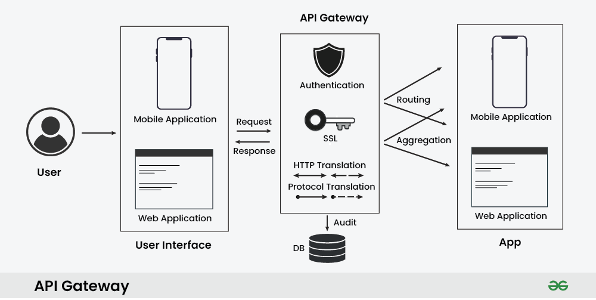

# API Gateway | System Design  

An API Gateway is a key component in system design, especially in **microservices architectures** and modern web applications. It acts as a **centralized entry point** that manages and routes client requests to appropriate backend services or microservices.

## What is an API Gateway?

An **API Gateway** is a **reverse proxy** that receives client requests and forwards them to the correct backend services. It performs essential functions like:

- Routing
- Authentication and Authorization
- Rate Limiting
- SSL Termination
- Caching
- Protocol Translation
- Request Aggregation

It hides the complexity of internal service architecture and provides a **single unified interface** to clients.

## How Does API Gateway Work?

### Step-by-Step Workflow:

1. **Routing**  
   Determines which backend service should handle the request based on URL, headers, or HTTP method.

2. **Protocol Translation**  
   Translates requests (e.g., HTTP → gRPC/WebSocket) to support various backend communication methods.

3. **Request Aggregation**  
   Combines multiple service calls into one request to reduce client-side overhead.

4. **Authentication and Authorization**  
   Verifies identity (e.g., JWT, OAuth) and checks if the user has permission to access the resource.

5. **Rate Limiting and Throttling**  
   Limits how many requests a client can make in a specific time to prevent abuse.

6. **Load Balancing**  
   Distributes requests across multiple service instances.

7. **Caching**  
   Caches responses to reduce load and improve performance.

8. **Monitoring and Logging**  
   Tracks system metrics, logs errors, and provides observability into the request flow.

## How Differently API Gateway Works with Microservices and Monolith Architecture?

| Aspect | Monolithic Architecture | Microservices Architecture |
|--------|-------------------------|-----------------------------|
| **Request Routing** | Routes to parts of one application | Routes to different microservices |
| **Service Discovery** | Not required | Required to locate services dynamically |
| **Authentication/Authorization** | Simple | Complex, may involve multiple services |
| **Load Balancing** | Basic | Advanced, across many services |
| **Fault Tolerance** | Less critical | Essential for resilience |

## API Gateway with Microservices Example

### Scenario:
An e-commerce application with microservices: `User`, `Catalog`, `Cart`, and `Order`.

**Flow:**
- The web app communicates with the API Gateway.
- The Gateway routes requests to specific services (e.g., `/users` → User Service).
- Handles auth, rate limits, caching.
- Standardizes error responses.

## API Gateway with Monolith Example

### Scenario:
A traditional monolithic e-commerce platform.

**Flow:**
- Web app sends requests to API Gateway.
- Gateway forwards to monolith backend.
- It still handles:
  - Security (auth, rate limiting)
  - Caching
  - Versioning
  - Error transformation

## Best Practices for Implementing API Gateway

- **Security**  
  - Use SSL/TLS  
  - Implement strong auth (OAuth, JWT)  
  - Enable IP whitelisting, rate limiting  

- **Performance Optimization**  
  - Use caching and compression  
  - Optimize request routing  

- **Scalability**  
  - Enable horizontal scaling  
  - Monitor and auto-scale based on metrics  

- **Monitoring and Logging**  
  - Integrate centralized log systems  
  - Use Prometheus, Grafana, or similar tools  

- **Error Handling**  
  - Use standardized error formats  
  - Graceful failure and retries  

- **Versioning and Documentation**  
  - Keep APIs backward-compatible  
  - Maintain OpenAPI (Swagger) docs

## Benefits of Using an API Gateway

- **Centralized Entry Point**  
  Simplifies client interactions with complex systems.

- **Routing and Load Balancing**  
  Directs requests to the right service; balances load across instances.

- **Authentication and Authorization**  
  Enforces secure access via tokens and API keys.

- **Request/Response Transformation**  
  Supports format translation (e.g., JSON ↔ XML) for compatibility.

## Challenges of Using an API Gateway

- **Performance Bottlenecks**  
  Gateway can become a single point of failure if overloaded.

- **Increased Latency**  
  Complex routing and auth may slow down responses.

- **Configuration Complexity**  
  Harder to manage in large-scale environments.

- **Security Risks**  
  Poorly configured gateways may expose vulnerabilities.

- **Scalability Challenges**  
  Requires advanced load balancing and autoscaling for high demand.

## Popular API Gateway Solution

| Gateway | Description |
|--------|-------------|
| **Amazon API Gateway** | Fully managed, supports REST/WebSocket APIs, scalable. |
| **Apigee (Google Cloud)** | Enterprise-grade, analytics, monetization, developer portal. |
| **Kong** | Open-source, Nginx-based, extensible with plugins. |
| **Azure API Management** | Secure, manage, and monitor APIs in Azure. |
| **Apache APISIX** | Cloud-native, high-performance, rich plugin ecosystem. |

