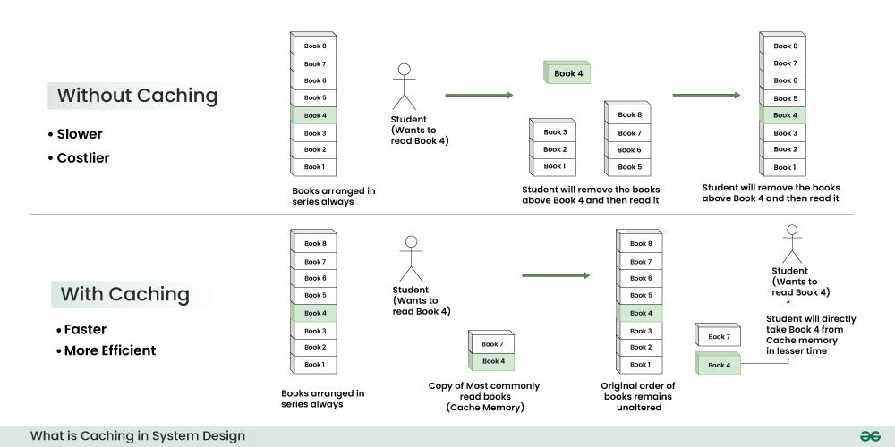
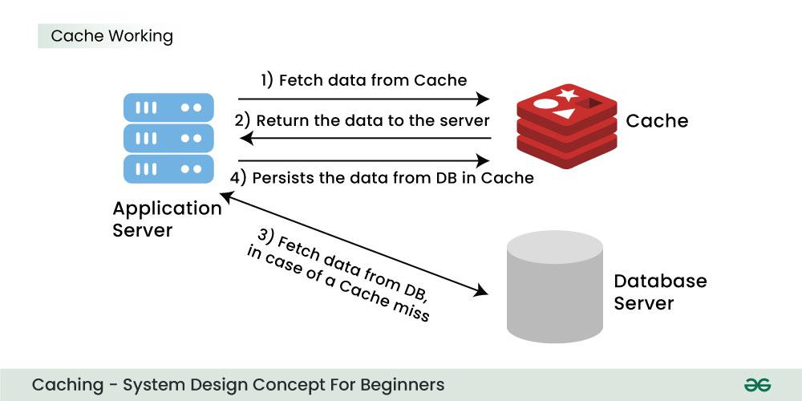
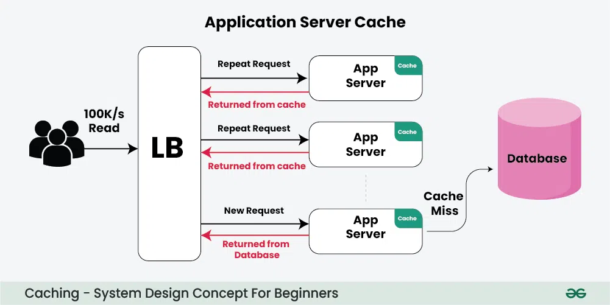
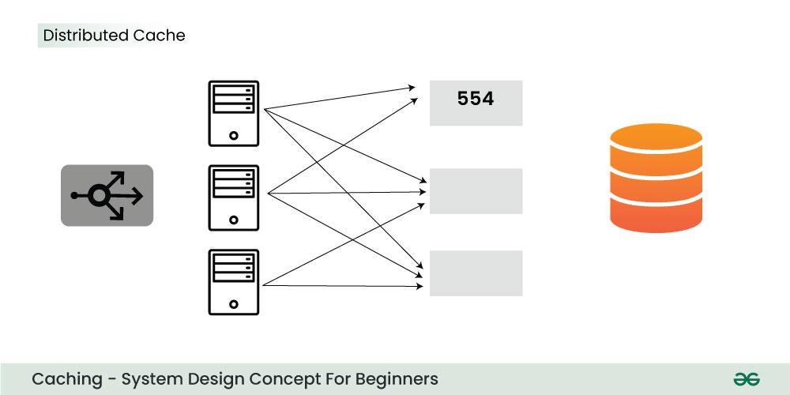
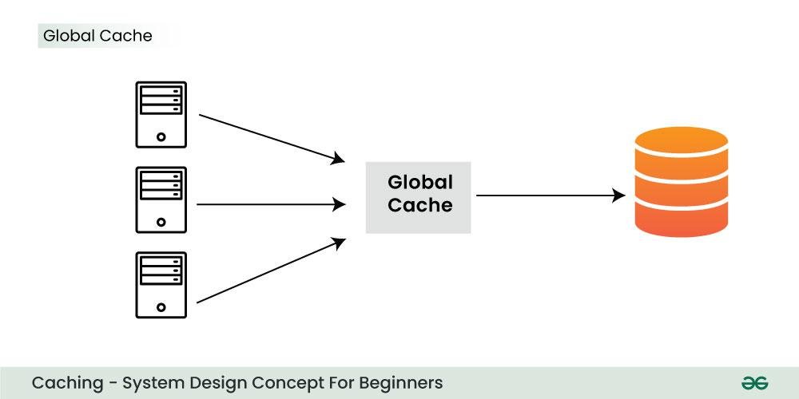
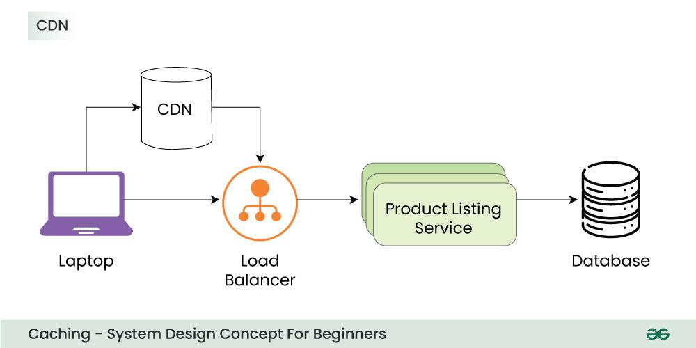

# Caching 

## What is Caching?

Let's imagine a library where books are stored on shelves. Retrieving a book from a shelf takes time, so a librarian decides to keep a small table near the entrance. This table is like a cache, where the librarian places the most popular or recently borrowed books.

Now, when someone asks for a frequently requested book, the librarian checks the table first. If the book is there, it's quickly provided. This saves time compared to going to the shelves each time. The table acts as a cache, making popular books easily accessible.

The same thing happens in a system. Accessing data from **primary memory (RAM)** is faster than from **secondary memory (disk)**. Caching acts as the local store for the data and retrieving data from this local or temporary storage is easier and faster than retrieving it from the database.

> Consider it as a short-term memory that has limited space but is faster and contains the most recently accessed items.

### Why you cannot store all the data in cache?

- Cache hardware is much more expensive than a normal database.
- Search time increases if too much data is stored in the cache.
- Cache is typically volatile — data is lost if the system crashes or restarts.

So, a cache should only store the **most relevant** data that is likely to be requested soon.

## How Does Cache Work?

Typically, web applications store data in a database. When a client requests some data, it is fetched from the database and returned to the user. This involves **network calls** and **I/O operations**, which are time-consuming.

### Example: Twitter

When a tweet becomes viral, many users request it. Reading it from the disk every time is inefficient. Here's how caching helps:

1. On the first request, data is fetched from the database — this is a **cache miss**.
2. Before returning the data to the user, it's stored in the **cache**.
3. On subsequent requests, the system first checks the **cache** — this is a **cache hit**.
4. Response time is much lower on a cache hit compared to a miss.

## Types of Cache

### 1. Application Server Cache

A cache layer within the application server that temporarily stores frequently accessed data to reduce database load.

**Example:** Storing frequently accessed user profiles or product lists.

**Drawbacks:**

- When multiple servers are used, each has its own isolated cache.
- This causes many **cache misses** due to lack of shared data.

**Solutions:**

- Use **Distributed Cache**
- Use **Global Cache**

### 2. Distributed Cache

In a distributed cache:

- Each node holds part of the cache.
- A **consistent hashing function** routes each request to the appropriate node.
- The system quickly locates which node has the cached data.

### 3. Global Cache

All nodes use a **single shared cache space**.

Two types:
1. **Cache handles the miss** and fetches from the database.
2. **Requesting node handles the miss** and fetches directly from the database.

### 4. CDN (Content Delivery Network)

A **CDN** is a group of globally distributed servers that:

- Stores web content like HTML, CSS, JS, images, videos.
- Delivers content from the **closest geographic server**.
- Reduces load time and increases speed for static content.

## Applications of Caching

- **Web Page Caching:** Browsers store frequently visited websites for faster loading.
- **Database Caching:** Reduces load by storing frequent queries in memory.
- **CDNs:** Serve static content globally from the nearest server.
- **Session Caching:** Keeps user session data like login status.
- **API Response Caching:** Cache frequently requested API data like weather or stock prices.

## Advantages of using Caching

- **Improved performance:** Faster access to frequently used data.
- **Reduced load on source:** Less pressure on databases and backend systems.
- **Cost savings:** Less need for expensive infrastructure upgrades.

## Disadvantages of using Caching

- **Data inconsistency:** Cached data may become stale.
- **Eviction issues:** Poor eviction policies can harm performance.
- **Added complexity:** Caching introduces complexity in design and maintenance.

## Cache Invalidation Strategies

Caching boosts performance, but invalidation is essential to ensure **freshness**.

- **Time-based expiration:** Cached data is discarded after a set time.
- **Event-driven invalidation:** Triggered by changes to the original data.

Proper invalidation avoids serving **outdated or incorrect** information.

## Eviction Policies of Caching

Eviction policies manage limited cache space by deciding which items to remove.

### Common Policies:

- **LRU (Least Recently Used):** Removes least recently accessed data.
- **LFU (Least Frequently Used):** Removes least accessed data overall.
- **FIFO (First-In-First-Out):** Removes the oldest cached data.

## Reference

[caching gfg](https://www.geeksforgeeks.org/caching-system-design-concept-for-beginners/)
