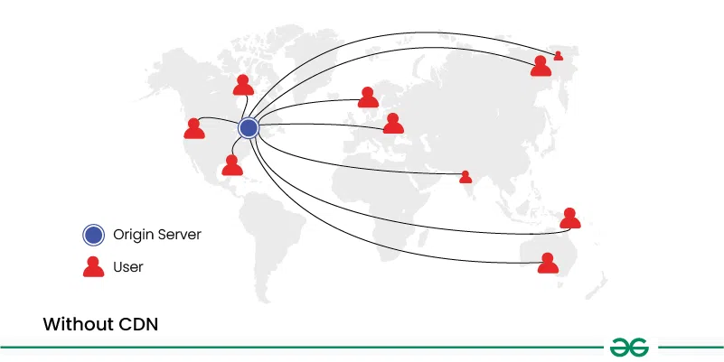
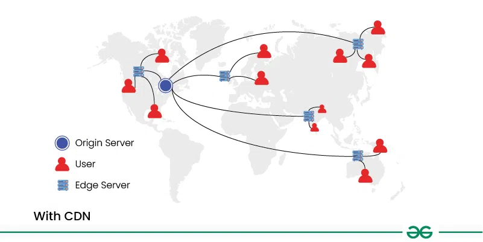

# Content Delivery Network (CDN) in System Design  

## What is Content Delivery Network (CDN)?

A **Content Delivery Network (CDN)** is a distributed network of servers that work together to deliver content (like images, videos, and static files) to users faster and more efficiently.

These servers, called **edge servers**, are strategically positioned across various geographical locations.

CDNs help improve the **performance**, **reliability**, and **scalability** of websites and web applications by caching content closer to users, reducing latency, and offloading traffic from origin servers.

### 1. Without CDN

- The request goes directly to the origin server.
- If the server is far from the user, loading times increase.
- High traffic may lead to slow response or downtime.



### 2. With CDN

- Request is routed to the nearest edge server.
- Content is delivered faster due to proximity.
- Reduces load on the origin server and improves availability.



## Importance of Content Delivery Network (CDN)

CDNs offer several key benefits:

- **Faster Content Delivery**: Reduces physical distance for data travel.
- **Improved Website Performance**: Enhances user engagement and conversions.
- **Scalability**: Distributes load efficiently, especially during traffic spikes.
- **Redundancy and Reliability**: Fallback servers ensure availability.
- **Cost Savings**: Reduces bandwidth and infrastructure expenses.
- **Security**: Offers DDoS protection, SSL/TLS, and WAFs.


## Types of CDNs

### 1. Public CDNs  
Accessible by everyone. Used to deliver static content like images and videos.

- **Examples**: Cloudflare, Akamai, Amazon CloudFront

### 2. Private CDNs  
Used by a single organization, often hosted privately.

- **Examples**: Google Cloud CDN, Netflix Open Connect

### 3. Peer-to-Peer (P2P) CDNs  
Utilize user devices to share content among themselves.

- **Examples**: BitTorrent, WebTorrent

### 4. Hybrid CDNs  
Combine public and private CDNs for optimized delivery.

- **Examples**: Microsoft Azure CDN

### 5. Push CDNs  
Content is manually uploaded to CDN servers beforehand.

- **Examples**: KeyCDN, CDN77

### 6. Pull CDNs  
Content is fetched from origin servers when requested.

- **Examples**: Amazon CloudFront, Cloudflare


## How Does Content Delivery Network (CDN) Work?

1. User requests content (e.g., image) from a website.
2. CDN detects user's location and routes to nearest edge server.
3. If cached, edge server delivers the content directly.
4. If not, it retrieves from the origin server, caches it, and delivers.
5. Future requests are served from cache for better performance.


## Components of CDN

- **Edge Servers**: Deliver and cache content near users.
- **Origin Server**: Source of original content.
- **Content Distribution Nodes**: Route and optimize traffic.
- **Control Plane**: Manages caching, routing, and load balancing.


## Content Delivery Network Use Cases

- **Streaming Media Delivery**: Smooth audio/video playback.
- **Software Distribution**: Reliable downloads and updates.
- **E-commerce**: Faster product image and data loading.
- **Gaming**: Reduced latency for seamless gameplay.
- **API Delivery**: Improves mobile app and service performance.


## How to Incorporate CDN into Web Application Design

### Steps:

1. **Pick a CDN provider**  
2. **Set up CDN**  
3. **Ensure smooth operation**

### Example: Include Bootstrap via CDN

**Step 1**: Choose a CDN Provider  
Bootstrap offers its own CDN.

**Step 2**: Link to Bootstrap CSS  
Add this line to your HTML `<head>`:

```html
<link href="https://cdn.jsdelivr.net/npm/bootstrap@5.3.0/dist/css/bootstrap.min.css" rel="stylesheet">
