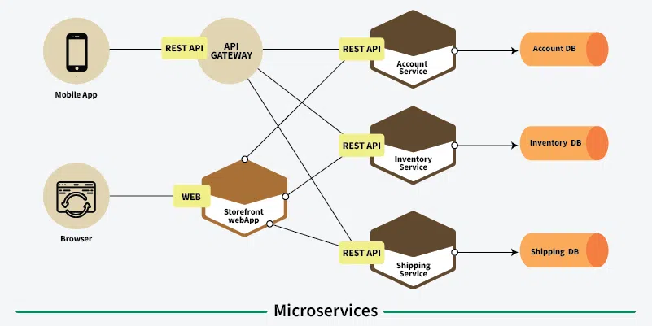
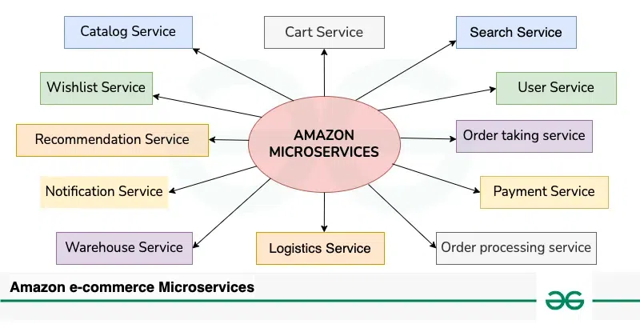

# Microservices  

Microservices are an architectural approach to developing software applications as a collection of small, independent services that communicate with each other over a network. Instead of building a monolithic application where all the functionality is tightly integrated into a single codebase, microservices break down the application into smaller, loosely coupled services.

## What are Microservices?
A **microservice** is a small, loosely coupled service designed to perform a specific business function. Each microservice can be developed, deployed, and scaled independently. This architecture allows you to break a large monolithic application into small, manageable components.

Microservices:
- Can be written in different languages/frameworks.
- Act as mini-applications with their own logic and data storage.
- Are building blocks of modern applications.

## How do Microservices Work?

1. Applications are divided into self-contained services.
2. Each microservice handles a distinct business feature (e.g., authentication).
3. Services communicate via APIs.
4. Each service can use different technologies.
5. Independent updates increase resilience and reduce risk.

## Main Components of Microservices Architecture

- **Microservices**: Small services, each handling a specific business task.
- **API Gateway**: Central entry point that routes requests and manages authentication.
- **Service Registry and Discovery**: Tracks locations of all services for dynamic communication.
- **Load Balancer**: Distributes traffic evenly across service instances.
- **Containerization**: Services are encapsulated in containers (e.g., Docker); managed by orchestration tools like Kubernetes.
- **Event Bus / Message Broker**: Manages asynchronous communication.
- **Database per Microservice**: Promotes data autonomy.
- **Caching**: Improves performance by storing frequently accessed data.
- **Fault Tolerance Components**: Includes circuit breakers, retries to handle failures gracefully.

## Design Patterns for Microservices Architecture

1. **API Gateway Pattern**: A single point of access for all clients.
2. **Service Registry Pattern**: Keeps a dynamic list of service locations.
3. **Circuit Breaker Pattern**: Prevents system overload by stopping repeated failed calls.
4. **Saga Pattern**: Manages transactions that span multiple services with compensation logic.
5. **Event Sourcing Pattern**: Stores events instead of current state.
6. **Strangler Fig Pattern**: Gradual migration from monolith to microservices.
7. **Bulkhead Pattern**: Isolates services to prevent total failure.
8. **API Composition Pattern**: Aggregates data from multiple services into one response.
9. **CQRS Pattern**: Separates read and write operations for scalability.

## Anti-Patterns for Microservices Architecture

- Sharing a centralized database compromises independence.
- Excessive inter-service communication increases latency.
- Over-fragmentation (too many tiny services) adds complexity.
- Unclear service boundaries create confusion.
- Ignoring security can expose the system to attacks.

## Real-World Example of Microservices

**Amazon E-Commerce Application:**

| Service | Function |
|--------|----------|
| User Service | Manages user accounts and preferences |
| Search Service | Helps users find products |
| Catalog Service | Manages product listings |
| Cart Service | Manages shopping cart items |
| Wishlist Service | Allows saving products |
| Order Taking Service | Accepts and validates orders |
| Order Processing Service | Coordinates fulfillment |
| Payment Service | Handles transactions |
| Logistics Service | Manages deliveries |
| Warehouse Service | Monitors inventory |
| Notification Service | Sends alerts and updates |
| Recommendation Service | Suggests products |

## Microservices vs. Monolithic Architecture

| Aspect | Microservices | Monolithic |
|--------|----------------|------------|
| **Architecture Style** | Decomposed services | Single integrated codebase |
| **Team Structure** | Small, cross-functional teams | Centralized large team |
| **Scalability** | Independently scalable | Must scale entire application |
| **Deployment** | Independent per service | Single unit deployment |
| **Resource Utilization** | Efficient | Higher resource consumption |
| **Development Speed** | Faster | Slower |
| **Flexibility** | High | Limited |
| **Maintenance** | Easier | More complex |

## How to Migrate from Monolithic to Microservices Architecture

1. **Evaluate** current monolith and identify components.
2. **Break Down** by business function.
3. Use **Strangler Pattern** for gradual migration.
4. Define **clear APIs** and service contracts.
5. Set up **CI/CD pipelines** for automation.
6. Introduce **service discovery mechanisms**.
7. Implement **centralized logging and monitoring**.
8. Handle **cross-cutting concerns** like security.
9. Take an **iterative approach** for continuous improvement.

## Service-Oriented Architecture(SOA) vs. Microservices Architecture

| Aspect | SOA | Microservices |
|--------|-----|---------------|
| **Scope** | Broad architectural style | Specific to small services |
| **Service Size** | Larger and comprehensive | Small and focused |
| **Data Management** | Shared data models | Own databases |
| **Communication** | SOAP, heavier protocols | REST, lightweight |
| **Technology** | Standardized middleware | Diverse technologies |
| **Deployment** | Independent but larger | Fully independent |
| **Scalability** | Horizontal scaling | Fine-grained scaling |
| **Development Speed** | Slower | Faster |
| **Flexibility** | Medium | High |

## Benefits and Challenges of Using Microservices Architecture

### Benefits:
- Parallel development across teams.
- Fault isolation enhances reliability.
- Independent scaling of services.
- Faster adaptation to changing needs.
- Technology flexibility per service.
- Empowered small, agile teams.

### Challenges:
- Complex service communication and latency.
- Higher complexity in development and deployment.
- Data consistency is harder to manage.
- Monitoring and debugging across services is complex.
- Distributed transactions are hard to implement.

## Real-World Examples of Companies Using Microservices Architecture

- **Amazon**: Moved from monolith to microservices early to enhance scalability and agility.
- **Netflix**: Adopted microservices after 2007 outages for better performance and reliability.
- **Uber**: Transitioned to microservices to improve performance and manage global operations efficiently.

## Roadmap to Understand Microservices

1. Understand monolith vs. microservices architecture.
2. Learn RESTful APIs and asynchronous messaging.
3. Study microservices design principles.
4. Explore containerization with Docker and Kubernetes.
5. Learn patterns: API Gateway, Circuit Breaker, Saga, etc.
6. Practice with real-world examples and build a sample app.
7. Explore monitoring/logging tools: ELK Stack, Prometheus, Grafana.
8. Master CI/CD and DevOps practices.
9. Experiment with scalability, fault tolerance, and resilience strategies.

